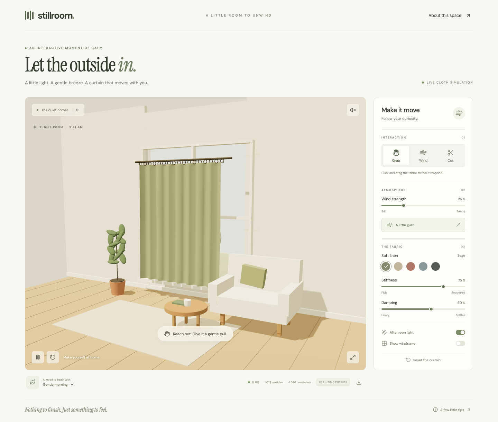

# Stillroom

### A little room to unwind.

An interactive cloth playground in a cozy, sunlit room. Pull the linen curtain, let a breeze in, or cut the fabric and watch it fall. Stillroom combines a calm interface with a real particle simulation rendered in Three.js.



## What you can do

- **Grab the curtain.** Pick a point on the fabric and drag it. Connected particles pull their neighbors along, then settle when released.
- **Add wind.** Adjust the continuous breeze, hold the Wind tool to apply a gust, or press **A little gust**.
- **Cut the fabric.** Draw across the curtain to break connections. Detached sections fall under gravity; reset restores the whole curtain.
- **Change the feel.** Tune stiffness and damping for a more fluid or structured fabric.
- **Set the mood.** Choose Sage, Oat, Clay, Mist, or Charcoal linen; switch lighting; or start with a Gentle morning, Open windows, or Quiet evening preset.
- **Look beneath the surface.** Show the constraint wireframe and monitor the frame rate, particle count, and remaining connections.
- **Take a pause.** Pause the simulation, enter fullscreen, enable ambient sound, or save a PNG of the room.

## Run locally

Use **Node.js 22.13 or later**, npm, and a modern browser with WebGL support.

```sh
git clone https://github.com/Hostlife22/stillroom.git
cd stillroom
npm ci
npm run dev
```

Open the local address printed by Vite, usually `http://localhost:5173`.

To try the production build:

```sh
npm run build
npm run preview
```

Vite writes the static site to `dist/`. That directory can be deployed to a static hosting service. For hosting under a subpath, configure Vite's `base` to match the deployment path.

## Controls

| Action              | Mouse or touch                               | Keyboard               |
| ------------------- | -------------------------------------------- | ---------------------- |
| Grab                | Select **Grab**, then drag the fabric        | **G** selects the tool |
| Wind                | Select **Wind**, then hold in the room       | **W** selects the tool |
| Cut                 | Select **Cut**, then trace across the fabric | **C** selects the tool |
| Pause / resume      | Press the play/pause button                  | **Space**              |
| Restore the curtain | Press either reset button                    | **R**                  |
| Close tips          | Press the close button                       | **Escape**             |

The application starts paused when the browser's **reduced motion** preference is enabled. Press play to begin. Ambient audio starts only after you enable it.

## How the cloth works

The curtain is a grid of **1,073 particles**: 29 columns by 37 rows. Its top row stays pinned to the rod. The initial mesh has **4,096 constraints** and **2,016 triangular faces**.

### Forces and constraints

- **Structural constraints** connect horizontal and vertical neighbors and resist stretching.
- **Shear constraints** connect diagonal neighbors and resist distortion across each grid cell.
- **Verlet-style integration** derives velocity from the current and previous particle positions. Gravity pulls the cloth down; wind pushes it sideways and forward with a varying force.
- **Damping** reduces velocity each step. The stiffness control changes how strongly each constraint corrects the distance between its particles.
- **Dragging** uses a raycast to select a particle and pulls it toward the pointer on a plane through the picked point.

### Stability and collisions

The solver runs at a fixed **1/120-second timestep**, with **nine constraint iterations per step**. Frame-time accumulation is capped at 50 ms, and per-step particle displacement is limited. Floor, back-wall, side, and depth bounds keep the fabric inside the simulation volume.

These are spring-like distance constraints solved through position corrections, rather than an unconstrained force-only spring system. The bounded timestep and repeated corrections help avoid runaway stretching during strong gusts or dragging.

### Cutting

The Cut tool disables nearby constraints along the pointer's path. Faces whose boundary constraints have been cut are removed from the rendered mesh. The surviving particles continue through the same physics solver, so detached cloth falls naturally. Reset rebuilds the original grid and its connections.

### Scope

Stillroom is a visual, interactive simulation. Collisions use room bounds; there is no cloth self-collision or collision against individual furniture meshes. It does not model physical units for a particular textile, bending constraints, or airflow around objects. On slower devices, the capped time accumulator can make the simulation advance more slowly than wall-clock time.

## Built with

| Technology               | Role                                                                                            |
| ------------------------ | ----------------------------------------------------------------------------------------------- |
| React                    | Interface, controls, and application state                                                      |
| Three.js                 | Room geometry, cloth mesh, lighting, shadows, and pointer raycasting                            |
| Vite                     | Development server and production bundling                                                      |
| Lucide React             | Interface icons                                                                                 |
| Custom JavaScript solver | Particle integration, structural and shear constraints, dragging, cutting, and collision bounds |
| Prettier + ESLint        | Consistent formatting and JavaScript / React Hooks checks                                       |
| Node.js test runner      | Physics stability, cutting, and reset tests                                                     |

The room is assembled from geometry in code. There is no external physics engine or downloaded 3D model. The interface uses DM Sans and Instrument Serif from Google Fonts, with local fallback fonts when those cannot load.

## Project structure

```text
src/
  main.jsx          React UI, controls, keyboard shortcuts, and ambient audio
  Scene.jsx         Three.js scene, rendering loop, and pointer interaction
  physics.js        Cloth particles and constraint solver
  physics.test.js   Stability, cutting, and reset tests
  styles.css        Design tokens, layout, controls, and responsive styles
docs/
  stillroom.png       Full-page screenshot
eslint.config.js    ESLint configuration
.prettierrc.json     Formatting rules
```

## Development commands

```sh
npm run dev           # Start the development server
npm run build         # Build the production site
npm run preview       # Preview the production build
npm run format        # Apply Prettier formatting
npm run format:check  # Check formatting without changing files
npm run lint          # Check JavaScript and React Hooks; warnings fail the check
npm run lint:fix      # Apply automatic ESLint fixes
npm test              # Run physics tests
npm run check         # Run formatting checks, ESLint, tests, and the build
```

The tests cover sustained strong wind and dragging, pinned particle positions, finite coordinates and collision bounds, structural and shear cuts, detached fabric falling, and reset restoring the constraints.
