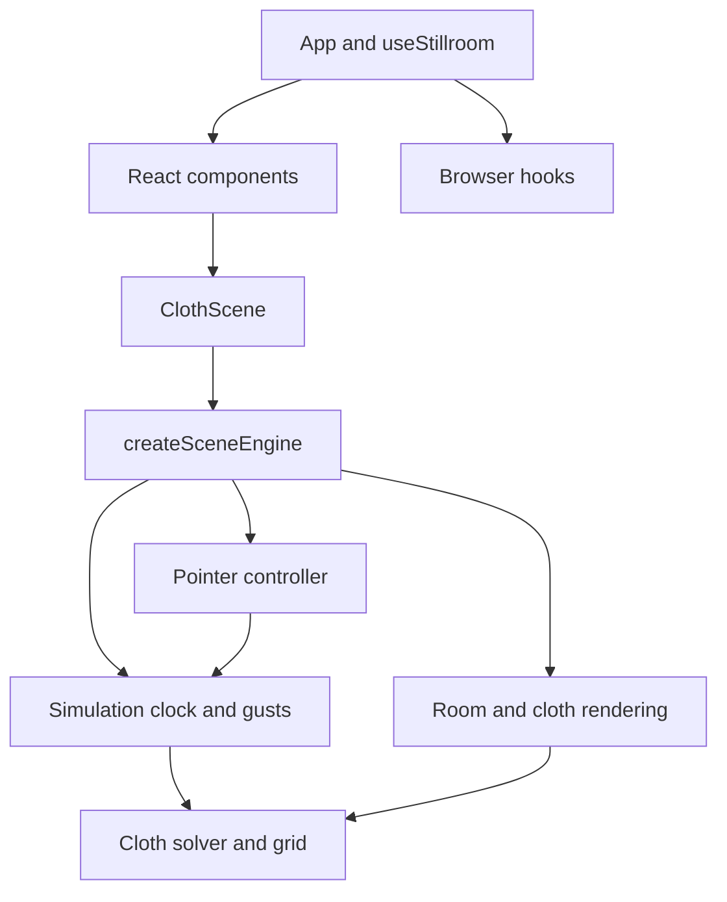

# Architecture

Stillroom is a TypeScript application with a React interface and a Three.js renderer. The simulation can run and be tested without React, a browser, or a graphics context.

## Module boundaries

### `app/`: application state and composition

`App.tsx` assembles the page. `useStillroom.ts` connects user actions to settings, browser hooks, and engine commands. `settings.ts` defines presets, fabric colors, initial state, and a pure reducer.

React owns settings and low-frequency UI state. Particle positions, frame timing, and active gestures stay outside React, so simulation frames do not cause component renders. Statistics are published roughly every 700 ms.

### `components/`: interface

`ControlPanel`, `SimulationStage`, `StatusBar`, `HelpDialog`, and `PageLayout` receive typed props. Shared range and toggle controls live in `components/ui/`.

`ClothScene` is the React adapter for the engine. Its mount effect creates an engine and its cleanup disposes it. A separate effect forwards settings changes without rebuilding the room. A stable ref exposes the engine's command interface to the application.

### `hooks/`: browser integrations

Audio, fullscreen, notifications, keyboard shortcuts, and dialog focus each have their own hook. Each hook owns the listeners, timer, or browser resource it creates and cleans them up when unmounted.

### `simulation/physics/`: numerical model

`Cloth.ts` owns particles, constraints, cutting, collision bounds, and the position solver. `createClothGrid.ts` constructs the initial grid and its triangle-to-constraint relationships. Configuration and types are separate from solver behavior.

Positions are three-number tuples. Constraints reference particles by index; faces reference the constraints that determine whether they remain visible after a cut. The top row is pinned.

This layer does not import React or Three.js and does not access the DOM. ESLint restricts imports that would cross that boundary.

### `simulation/Simulation.ts`: time and forces

`Simulation` owns the fixed timestep accumulator and gust decay. `advance(elapsed, settings)` caps long frames and applies physics steps. Pause discards accumulated time. Reset restores the grid and clears the current gust, drag, and accumulated time.

It accepts elapsed time as an argument, so tests can verify behavior under different render frame rates without using real timers.

### `simulation/input/`: pointer gestures

The pointer controller converts screen coordinates into world coordinates, raycasts against the cloth, and applies grab, cut, or wind gestures. It tracks one pointer at a time and releases capture on completion, cancellation, reset, or disposal.

Tests replace only the DOM event surface. They use real Three.js raycasting, cloth geometry, and the particle solver.

### `simulation/rendering/`: Three.js objects

- `createRoom.ts` builds static room geometry and lights.
- `createClothView.ts` projects particles and active constraints into mesh and wireframe buffers. Topology changes only after cutting or reset. The wireframe reuses its allocated buffer.
- `disposeScene.ts` releases geometry, shared materials, and shadow resources.

Rendering reads the numerical model. It does not modify particle positions or run the solver.

### `simulation/createSceneEngine.ts`: resource ownership

The engine connects the scene, camera, renderer, simulation, and pointer controller. It owns `requestAnimationFrame`, `ResizeObserver`, and their cleanup.

Its public API is defined by `SceneEngine` in `simulation/types.ts`:

| Method                  | Purpose                                                                        |
| ----------------------- | ------------------------------------------------------------------------------ |
| `setSettings(settings)` | Apply UI settings without recreating the engine                                |
| `reset()`               | End the gesture and restore the cloth and render topology                      |
| `gust()`                | Add a wind impulse                                                             |
| `snapshot()`            | Download the current rendered scene                                            |
| `dispose()`             | Stop frames, detach input and resize listeners, and release graphics resources |

### `styles/`: presentation

The CSS entry point imports tokens, browser defaults, page layout, scene overlays, controls, statistics, the dialog, and responsive rules. Responsive overrides load last. Existing class names and styling are retained across the component split.

## Type checking and tests

`tsconfig.json` enables strict checking, unused-code checks, explicit type-only imports, and the automatic JSX runtime. Application modules and tests use `.ts` or `.tsx`; `eslint.config.js` remains a JavaScript tool configuration.

`npm run check` runs Prettier, ESLint, TypeScript, Node tests, and the Vite production build. Tests are colocated with the modules they cover and run with Node's TypeScript stripping; `tsc` checks their types separately.

The test suite covers solver stability, cutting and reset, fixed-step timing, pause/resume, pointer capture and cancellation, real raycasting, render topology, buffer reuse, resource disposal, and settings transitions. A browser check is still needed for visual appearance, WebGL availability, audio, and fullscreen behavior.

## Extending the application

- Add a control to a component and its state transition to `settings.ts`.
- Put a new force or constraint in the physics layer and test it without a renderer.
- Keep new room objects in the rendering layer and under scene resource ownership.
- Add browser APIs through hooks or the engine adapter, with explicit cleanup.
- Keep deployment paths in `vite.config.ts`; the GitHub Pages base is `/stillroom/`.
